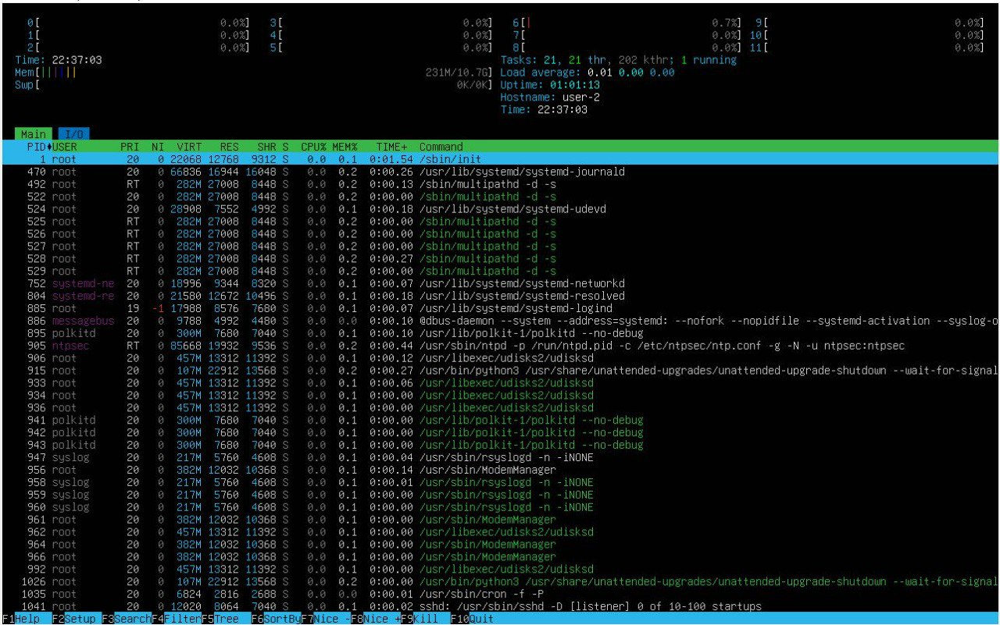

## Part 1. Установка ОС

**== Задание ==**

##### Установи **Ubuntu 20.04 Server LTS** без графического интерфейса. (Используем программу для виртуализации - VirtualBox)

- Устанавливаем Ubuntu 20.04 Server LTS без графического интерфейса с официального сайта на VirtualBox
- Результат выполнения `cat /etc/issue`

*Версия ОС*

## Part 2. Создание пользователя

**== Задание ==**

##### Создай пользователя, отличного от созданного при установке. Пользователь должен быть добавлен в группу `adm`.

*Создание пользователя*

- Создаём нового пользователя с помощью команды `useradd`
- Флаг `-g` нужен для добавления пользователя в группу
- `adm` - название группы. Она существует по умолчанию, можно проверить её наличие командой `vi /etc/group`

*Вывод команды `cat /etc/passwd`*

*Проверяем добавлен ли пользователь в группу `adm`*

## Part 3. Настройка сети ОС

**== Задание ==**

##### Задай название машины вида user-1.

- Задаем название машины командой `sudo hostnamectl set-hostname user-1`

*Задаем название машины*

*Проверяем название машины командой `hostname`*

##### Установи временную зону, соответствующую твоему текущему местоположению.  

- Устанавливаем временную зону с помощью команды `sudo timedatectl set-timezone Europe/Moscow`

*Задаем московское время*

*Проверяем что изменения вступили в силу командой `timedatectl`*

##### Выведи названия сетевых интерфейсов с помощью консольной команды.

- Выводим названия сетевых интерфейсов с помощью команды `ls /sys/class/net`

*Названия сетевых интерфейсов*

- `lo` – виртуальный интерфейс, присутствующий по умолчанию в любом Linux. Он используется для отладки сетевых программ и запуска серверных приложений на локальной машине. С этим интерфейсом всегда связан адрес 127.0.0.1. 

##### Используя консольную команду, получи ip адрес устройства, на котором ты работаешь, от DHCP сервера. 

- С помощью команды `ip address show` получаем ip адрес устройства от DHCP сервера - `10.0.2.15`

*Получение IP адреса*

- `DHCP(Dynamic Host Configuration Protocol)` - протокол прикладного уровня модели TCP/IP, служит для назначения IP-адреса клиенту. 

##### Определи и выведи на экран внешний ip-адрес шлюза (ip) и внутренний IP-адрес шлюза, он же ip-адрес по умолчанию (gw). 

- С помощью команды `curl ifconfig.me/ip` узнаём внешний ip-адрес шлюза (ip) - `85.94.26.248`
- С помощью команды `ip route | grep default` узнаём ip-адрес по умолчанию (gw) - `10.0.2.2`

*Получение внешнего и внутреннего ip адреса шлюза*

##### Задай статичные (заданные вручную, а не полученные от DHCP сервера) настройки ip, gw, dns (используй публичный DNS серверы, например 1.1.1.1 или 8.8.8.8).  

- С помощью команды `sudo vi /etc/netplan/50-cloud-init.yaml` задаем вручную ip, gw, dns

*Файл до изменения*

*Файл после изменения*

- С помощью команды `sudo netplan apply` принимаем изменения 

##### Перезагрузи виртуальную машину. Убедись, что статичные сетевые настройки (ip, gw, dns) соответствуют заданным в предыдущем пункте.  

- С помощью команды `reboot` перезагружаем машину

*Проверяем что изменения вступили в силу командой `ip route`*

*Пингуем хост 1.1.1.1, задаём ограничение на 10 пакетов флагом `-c 10`*

*Пингуем хост ya.ru, задаём ограничение на 10 пакетов флагом `-c 10`*

## Part 4. Обновление ОС

**== Задание ==**

##### Обнови системные пакеты до последней на момент выполнения задания версии.  

- `sudo apt-get update` обновляет локальную базу данных менеджера пакетов, которая содержит информацию обо всех пакетах. При выполнении этой команды менеджер пакетов загружает список доступных обновлений из репозиториев, но не устанавливает сами обновления

- `sudo apt-get upgrade` используется для фактической установки обновлений, которые были загружены с помощью команды `update`. При выполнении этой команды менеджер пакетов обновляет конкретные пакеты до их последних версий, если такие версии доступны

*При повторном вводе команды получаем сообщение об отсутствии обновлений*

## Part 5. Использование команды **sudo**

**== Задание ==**

##### Разреши пользователю, созданному в [Part 2](#part-2-создание-пользователя),выполнять команду sudo.

- `sudo` ( substitute user and do, подменить пользователя и выполнить ) - это утилита для операционных систем семейства Linux, позволяющая пользователю запускать программы с привилегиями другой учётной записи, как правило, суперпользователя

- Для того чтобы дать пользователю `newuser` право использовать `sudo` необходимо добавить его в группу `sudo` с помощью команды `usermod -a -G sudo newuser` 
- `usermod` - изменяет учётную запись пользователя
- Флаг `-a` нужен чтобы добавить пользователя в указанную группу без удаления его из других групп
- Флаг `-G` указывает на группу, к которой нужно добавить пользователя

*Проверяем что пользователь newuser добавлен в группу `sudo` с помощью команды `groups`*

- Меняем hostname ОС на `user-2` от имени `newuser` командой `sudo -u newuser hostnamectl set-hostname user-2`
- Флаг `-u` необходим для выполнения команды от имени другого пользователя

*Проверяем что имя хоста изменено командой `hostname`*

## Part 6. Установка и настройка службы времени

**== Задание ==**

##### Настрой службу автоматической синхронизации времени. 

*Вывод команды `timedatectl`*

- Устанавливаем NTP-сервер командой `sudo apt-get install ntp`

*Проверяем что вывод команды `timedatectl show` содержит `NTPSynchronized=yes`*

*Командой `date` проверяем что текущее время корректно*

## Part 7. Установка и использование текстовых редакторов 

**== Задание ==**

##### Установи текстовые редакторы **VIM** (+ любые два по желанию **NANO**, **MCEDIT**, **JOE** и т.д.)  

- Редактор `vim` уже установлен, но если его нет, та можно установить с помощью команды `sudo apt install vim`

- Редактор `nano` уже установлен, но если его нет, та можно установить с помощью команды `sudo apt install nano`

- Редактор `mcedit` устанавливаем командой `sudo apt install mc`

##### Используя каждый из трех выбранных редакторов, создай файл *test_X.txt*, где X -- название редактора, в котором создан файл. Напиши в нём свой никнейм, закрой файл с сохранением изменений.  

- Создаём файл в редакторе `vim` командой `vim test_vim.txt`
- Для редактирования файла необходимо нажать клавишу `I`
- Чтобы выйти из режима редактирования нажимем клавишу `Esc`
- Для сохранения и выхода пишем `:wq` и нажимаем `Enter`

*Содержимое файла перед закрытием*

*Проверяем что файл был создан и изменения сохранены*

- Создаём файл в редакторе `nano` командой `nano test_nano.txt`
- Нажимаем `Ctrl+O` для сохранения изменений, затем `Enter`
- Нажимаем `Ctrl+X` для выхода из программы

*Содержимое файла перед закрытием*

*Проверяем что файл был создан и изменения сохранены*

- Создаём файл в редакторе `mcedit` командой `mcedit test_mcedit.txt`
- Нажимаем `F2` `Save` для сохранения изменений 
- Нажимем `F10` для выхода из программы

*Содержимое файла перед закрытием*

*Проверяем что файл был создан и изменения сохранены*

##### Используя каждый из трех выбранных редакторов, открой файл на редактирование, отредактируй файл, заменив никнейм на строку «21 School 21», закрой файл без сохранения изменений.

- Открываем файл для редактирования в `vim` командой `vim test_vim.txt`
- Для редактирования файла необходимо нажать клавишу `I`
- Чтобы выйти из режима редактирования нажимем клавишу `Esc`
- Для выхода без изменений пишем `:q!` и нажимаем `Enter`

*Содержимое файла перед закрытием*

*Проверяем что изменения не сохранены*

- Открываем файл в редакторе `nano` командой `nano test_nano.txt`
- Нажимаем `Ctrl+X` для выхода из программы, вводим `N`

*Содержимое файла перед закрытием*

*Проверяем что изменения не сохранены*

- Открываем в редакторе `mcedit` командой `mcedit test_mcedit.txt`
- Нажимем `F10` `No` для выхода из программы

*Содержимое файла перед закрытием*

*Проверяем что изменения не сохранены*

##### Используя каждый из трех выбранных редакторов, отредактируй файл ещё раз (по аналогии с предыдущим пунктом), а затем освой функции поиска по содержимому файла (слово) и замены слова на любое другое.

- Открываем файл для редактирования в `vim` командой `vim test_vim.txt`
- Для поиска слова `hello` используем команду `/hello`

*Результат выполнения поиска по слову*

- Для замены слова `bandwidl` на слово `hello` используем команду `:s/bandwidl/hello`

*Результат замены*

- Открываем файл в редакторе `nano` командой `nano test_nano.txt`
- Для поиска слова `hello` используем сочетание клавиш `Ctrl+W`

*Результат выполнения поиска по слову*

- Для замены слова `bandwidl` на слово `hello` используем сочетание клавиш `Ctrl+\`. Вводим слово, которое надо заменить, а затем на какое надо заменить

*Вводим слово, которое надо заменить*

*Вводим слово, на которое надо заменить*

*Подтверждаем замену*

*Результат замены*

- Открываем в редакторе `mcedit` командой `mcedit test_mcedit.txt`
- Для поиска по слову нажимем `F7` и вводим слово

*Результат выполнения поиска по слову*

- Для замены слова `bandwidl` на слово `hello` нажимаем `F4`. В верхнюю строку вводим слово которое надо заменить, а в нижнюю - на какое

*Замена слова*

*Результат замены*

## Part 8. Установка и базовая настройка сервиса **SSHD**

**== Задание ==**

##### Установи службу SSHd.  

- Командой `sudo apt-get install ssh` устанавливаем ssh-клиент

- Командой `sudo apt install openssh-server` устанавливаем ssh-сервер

##### Добавь автостарт службы при загрузке системы.  

*Командой `sudo systemctl enable sshd` добавляем пакет SSH-сервера в автозагрузку*

*Командой `systemctl status sshd` проверяем работоспособность ssh*

##### Перенастрой службу SSHd на порт 2022.  

- Для замены порта необходимо открыть файл конфигурации командой `sudo vim /etc/ssh/sshd_config` и изменить номер порта

*Меняем порт с `22` на `2022`*

*Перезагружаем систему и убеждаемся что порт изменен*

##### Используя команду ps, покажи наличие процесса sshd. Для этого к команде нужно подобрать ключи.

- Для отображения процесса `sshd` с помощью команды `ps` используем команду `ps aux | grep sshd`
- `ps (process status)` - команда, которая выводит список текущих процессов на вашем сервере
 - Ключ `a` в команде `ps` позволяет отображать процессы всех пользователей, а не только текущего пользователя. Он показывает процессы по всей системе.
 - Ключ `u` в команде `ps` позволяет выводить дополнительную подробную информацию о каждом процессе, такую как имя пользователя владельца процесса, идентификатор пользователя (UID), процесс ID (PID), процент использования ЦП и памяти и другие параметры.
 - Ключ `x` в команде `ps` предназначен для включения в вывод процессы, которые не являются терминальными, то есть процессы, которые не связаны с текущим терминалом (например, процессы демонов).
- `|` - это символ pipe, который направляет вывод `ps aux` на ввод команды `grep`.
- `grep sshd` - используется для фильтрации вывода, отображая только строки, содержащие `sshd`.

*Вывод команды `ps aux | grep sshd`*

##### Перезагрузи систему.

- Перезагружаем систему командой `reboot`

- `Netstat` — происходит от слов network statistics — это утилита командной строки, используемая системными администраторами для анализа статистики сети. Она отображает всю статистику, такую ​​как открытые порты и соответствующие адреса в хост-системе, таблицы маршрутизации и masquerade соединения
- Ключ `-t` в команде `netstat` используется для отображения только TCP-соединений
- Ключ `-a` в команде `netstat` показывает все сетевые соединения и порты, включая слушающие и активные соединения
- Ключ `-n` в команде `netstat` переключает отображение адресов и портов в числовой формат, а не в символьные имена. Это удобно для быстрого определения числовых значений IP-адресов и портов

*Вывод команды `netstat -tan`*

- `Proto` - протокол соединения
- `Recv-Q`- rоличество байт, ожидающих чтения приемником
- `Send-Q`- количество байт, ожидająщих отправки
- `Local Address` - IP-адрес и порт на локальной машине
- `Foreign Address` - IP-адрес и порт на удаленной машине
- `State*` - состояние TCP-соединения
- `0.0.0.0` или `:::*` означает что соединение доступно через любой сетевой интерфейс

## Part 9. Установка и использование утилит **top**, **htop**

**== Задание ==**

##### Установи и запусти утилиты top и htop. 

*Вывод команды top*

- Uptime 20:13:27 up 33 min
- Количество авторизованных пользователей - 1
- Общая загрузка системы - 0:00, 0:00, 0:00
- Общее количество процессов - 226
- Загрузка cpu - 0.0 us, 0.0 sy, 0.0 ni, 100.0 id, 0.0 ws, 0.0 hi, 0.0 si, 0.0 st
- Загрузка памяти MIB Mem: 10905.7 total, 10458.0 free, 478.1 used, 220.0 buff/cache
- Загрузка памяти MIB Swap: 0.0 total, 0.0 free, 0.0 used, 10427.6 avail Mem

*pid процесса занимающего больше всего памяти*

*pid процесса, занимающего больше всего процессорного времени*

*Вывод команды `htop`, отсортированный по PID*

*Вывод команды `htop`, отсортированный по PERCENT_CPU*

*Вывод команды `htop`, отсортированный по PERCENT_MEM*

*Вывод команды `htop`, отсортированный по TIME*

*Вывод команды `htop`, отфильтрованный для процесса sshd*

*Вывод команды `htop` с процессом syslog, найденным, используя поиск*

*Вывод команды `htop` с добавленным выводом hostname, clock и uptime*

## Part 10. Использование утилиты **fdisk**

**== Задание ==**

##### Запусти команду fdisk -l.

*Вывод команды `fdisk -l`*

- Название жесткого диска - /dev/sda
- Размер жесткого диска 25 GIB
- Количество секторов - 52428800

*Размер swap получаем командой `free -h`*

## Part 11. Использование утилиты **df** 

**== Задание ==**

##### Запусти команду df.  

*Вывод команды `df`*

- Размер раздела - 1175860
- Размер занятого пространства - 2597128
- Размер свободного пространства - 8542524 
- Процент использования - 24%
- Единица измерения - KiB 

##### Запусти команду df -Th.

*Вывод команды `df - Th`*

- Размер раздела - 12 Gb
- Размер занятого пространства - 2.5 Gb
- Размер свободного пространства - 8.2 Gb
- Процент использования - 24%
- Тип файловой системы - ext4

## Part 12. Использование утилиты **du**

**== Задание ==**

##### Запусти команду du

*Вывод команды `du`*

##### Выведи размер папок /home, /var, /var/log (в байтах, в человекочитаемом виде)

- `-h` для представления размеров в удобочитаемом формате
- `-s` используется для вывода общего размера папки

*Вывод команд `du -h /home и du -sh /home`*

*Вывод команд `du -h /var и du -sh /var`*

**Вывод команд `du -h /var/log и du -sh /var/log`*

##### Выведи размер всего содержимого в /var/log (не общее, а каждого вложенного элемента, используя *)

- Флаг `-a` нужен, чтобы выводить размер для всех файлов, а не только для директорий

*Вывод команды `du -ha /var/log/*`*

## Part 13. Установка и использование утилиты **ncdu**

**== Задание ==**

##### Установи утилиту ncdu

- Устанавливаем утилиту `ncdu` командой `sudo apt install ncdu`

##### Выведи размер папок /home, /var, /var/log

*Вывод команды `ncdu /home`*

*Вывод команды `ncdu /var`*

*Вывод команды `ncdu /var/log`*

## Part 14. Работа с системными журналами

**== Задание ==**

##### Открой для просмотра:
##### 1. /var/log/dmesg

*Вывод команды `vim /var/log/dmesg`*

##### 2. /var/log/syslog

*Вывод команды `vim /var/log/syslog`*

##### 3. /var/log/auth.log  

*Вывод команды `vim /var/log/auth.log`*

- Время последней успешной авторизации 21:06:2024 14:11:13
- Имя пользователя bandwidl
- Строка `pam_unix(systemd-user:session)` указывает на метод аутентификации пользователей `pam_unix` с использованием подсистемы `systemd-user:session` в системе

- Перезапускаем службу SSHd командой `sudo systemctl restart sshd`

*Сообщение о перезапуске службы sshd в логах*

## Part 15. Использование планировщика заданий **CRON**

**== Задание ==**

##### Используя планировщик заданий, запусти команду uptime через каждые 2 минуты.

- Открываем файл crontab для редактирования командой `crontab -e`
- Добавляем в него строчку `*/2 * * * * uptime`

*В системном журнале каждые 2 мин появляется строчка о выполнении `uptime`*

- Командой `crontab -l` выводим список текущих задач для CRON

*Cписок текущих задач для CRON*

##### Удали все задания из планировщика заданий.

- Командой `crontab -r` удаляем все задачи из планировщика

*Все задачи удалены*

